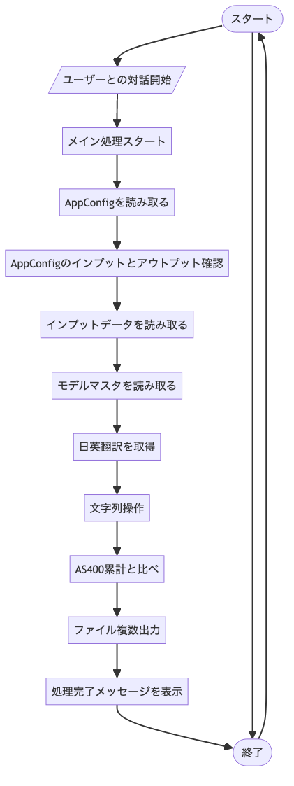

## Testing preview image from mermaid


- install mermaid cli
``` bash
npm install -g @mermaid-js/mermaid-cli
```

- convert file to image
``` bash
mmdc -i input.mmd -o output.png
```


 

added string 
